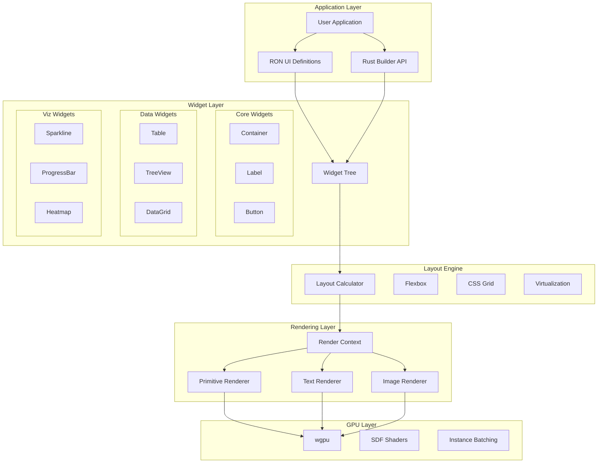

# Gloomy UI Library - Technical Design Document
## Vision: GPU-Accelerated Dense Data Display

---

## Architecture Overview



---

## Crate Structure

```
gloomy/
├── gloomy-core/           # Core rendering, layout, widgets
│   ├── src/
│   │   ├── lib.rs
│   │   ├── widget/        # Widget definitions
│   │   │   ├── mod.rs
│   │   │   ├── container.rs
│   │   │   ├── label.rs
│   │   │   ├── button.rs
│   │   │   ├── table.rs      # NEW: Table widget
│   │   │   ├── tree_view.rs  # NEW: TreeView widget
│   │   │   └── ...
│   │   ├── layout/        # Layout engine
│   │   │   ├── mod.rs
│   │   │   ├── flex.rs
│   │   │   ├── grid.rs
│   │   │   └── virtual.rs    # NEW: Virtualization
│   │   ├── render/        # GPU rendering
│   │   │   ├── mod.rs
│   │   │   ├── primitives.rs
│   │   │   ├── text.rs
│   │   │   └── image.rs
│   │   ├── interaction.rs
│   │   ├── theme.rs          # NEW: Theming
│   │   └── data.rs           # NEW: Data binding
├── gloomy-app/            # Windowing integration
├── gloomy-derive/         # Proc macros (future)
└── examples/
```

---

## Widget Catalog

### Core Widgets (Existing + Improvements)

| Widget | Status | Description |
|--------|--------|-------------|
| `Container` | ✅ | Layout container with flex/grid |
| `Label` | ✅ | Static text |
| `Button` | ✅ | Clickable button |
| `TextInput` | ✅ | Text entry field |
| `Checkbox` | ✅ | Toggle checkbox |
| `Slider` | ✅ | Range input |
| `Image` | ✅ | Image display |
| `Spacer` | ✅ | Layout spacing |
| `ScrollBar` | 🔲 NEW | Scrollbar indicator |
| `Divider` | 🔲 NEW | Visual separator line |
| `Tooltip` | 🔲 NEW | Hover tooltips |

### Data Display Widgets (NEW)

| Widget | Priority | Description |
|--------|----------|-------------|
| `Table` | P0 | Virtualized table with headers |
| `TreeView` | P1 | Hierarchical tree |
| `DataGrid` | P2 | Spreadsheet-like grid |
| `ListView` | P1 | Virtualized list |
| `PropertyGrid` | P2 | Key-value pairs |

### Visualization Widgets (NEW)

| Widget | Priority | Description |
|--------|----------|-------------|
| `Sparkline` | P1 | Mini line/bar chart |
| `ProgressBar` | P1 | Linear/circular progress |
| `Badge` | P2 | Status pills/tags |
| `StatusLED` | P2 | Red/yellow/green dots |
| `Heatmap` | P3 | Color-coded cells |
| `Gauge` | P3 | Radial value display |

---

## API Design

### Builder Pattern (Rust)

```rust
// Fluent builder API
let ui = Container::column()
    .padding(16.0)
    .spacing(8.0)
    .child(
        Label::new("System Monitor")
            .size(24.0)
            .color(Color::WHITE)
    )
    .child(
        Table::new()
            .columns(vec![
                Column::new("Process").flex(2.0),
                Column::new("PID").width(80.0),
                Column::new("CPU").width(60.0).align(Align::Right),
                Column::new("Memory").width(100.0),
            ])
            .data(&processes)  // Vec<ProcessInfo>
            .row_height(32.0)
            .on_row_click(|row| println!("Clicked: {:?}", row))
            .virtualized(true)
    )
    .build();
```

### RON Declaration

```ron
Container(
    layout: (direction: Column, spacing: 8.0),
    padding: 16.0,
    children: [
        Label(text: "System Monitor", size: 24.0),
        Table(
            columns: [
                (header: "Process", flex: 2.0),
                (header: "PID", width: 80.0),
                (header: "CPU", width: 60.0, align: Right),
                (header: "Memory", width: 100.0),
            ],
            data_source: "processes",
            row_height: 32.0,
            virtualized: true,
        ),
    ]
)
```

### Data Binding

```rust
// Reactive data model
struct AppState {
    processes: Vec<ProcessInfo>,
    selected_pid: Option<u32>,
}

// Data source trait
trait DataSource<T> {
    fn len(&self) -> usize;
    fn get(&self, index: usize) -> Option<&T>;
    fn subscribe(&self, callback: impl Fn());
}

// Table binds to data source
Table::new()
    .data_source(processes.as_source())
    .on_change(|_| request_redraw())
```

---

## Table Widget Design

### Structure

```rust
pub struct Table {
    pub columns: Vec<ColumnDef>,
    pub data: Box<dyn TableDataSource>,
    pub row_height: f32,
    pub header_height: f32,
    pub virtualized: bool,
    pub sticky_header: bool,
    pub sortable: bool,
    pub selectable: SelectMode,  // None, Single, Multi
    
    // State
    scroll_offset: f32,
    visible_range: Range<usize>,
    sort_column: Option<usize>,
    sort_direction: SortDir,
    selected_rows: HashSet<usize>,
}

pub struct ColumnDef {
    pub header: String,
    pub width: ColumnWidth,       // Fixed(f32), Flex(f32), MinMax(f32, f32)
    pub align: TextAlign,
    pub sortable: bool,
    pub resizable: bool,
    pub renderer: Option<CellRenderer>,  // Custom cell rendering
}

pub trait TableDataSource {
    fn row_count(&self) -> usize;
    fn cell_value(&self, row: usize, col: usize) -> CellValue;
    fn sort(&mut self, column: usize, direction: SortDir);
}

pub enum CellValue {
    Text(String),
    Number(f64),
    Bool(bool),
    Custom(Box<dyn Widget>),  // Embed any widget
}
```

### Virtualization Algorithm

```
┌─────────────────────────────────────┐
│        Header Row (sticky)          │  ← Always visible
├─────────────────────────────────────┤
│ ░░░░░░░ Hidden rows above ░░░░░░░░░ │  ← Not rendered
├─────────────────────────────────────┤
│         Visible Row 0               │  ← 
│         Visible Row 1               │  ← Buffer: overscan
│         Visible Row 2               │  ← 
│  ─ ─ ─ ─ Viewport Top ─ ─ ─ ─ ─ ─   │
│         Visible Row 3               │  ←
│         Visible Row 4               │  ← Actually visible
│         Visible Row 5               │  ←
│  ─ ─ ─ ─ Viewport Bottom ─ ─ ─ ─ ─  │
│         Visible Row 6               │  ←
│         Visible Row 7               │  ← Buffer: overscan
│         Visible Row 8               │  ←
├─────────────────────────────────────┤
│ ░░░░░░░ Hidden rows below ░░░░░░░░░ │  ← Not rendered
└─────────────────────────────────────┘

visible_start = floor(scroll_offset / row_height) - overscan
visible_end = ceil((scroll_offset + viewport_height) / row_height) + overscan
```

---

## TreeView Widget Design

```rust
pub struct TreeView {
    pub root: TreeNode,
    pub indent: f32,
    pub row_height: f32,
    pub show_lines: bool,
    pub multi_select: bool,
    pub lazy_load: bool,
}

pub struct TreeNode {
    pub id: String,
    pub label: String,
    pub icon: Option<String>,
    pub expanded: bool,
    pub children: Vec<TreeNode>,  // or lazy: Option<fn() -> Vec<TreeNode>>
    pub data: Option<Box<dyn Any>>,
}

// Virtualized flat list of visible nodes
fn flatten_visible(root: &TreeNode) -> Vec<&TreeNode> {
    let mut result = vec![];
    fn walk(node: &TreeNode, result: &mut Vec<&TreeNode>) {
        result.push(node);
        if node.expanded {
            for child in &node.children {
                walk(child, result);
            }
        }
    }
    walk(root, &mut result);
    result
}
```

---

## Theming System

```rust
pub struct Theme {
    pub colors: Colors,
    pub fonts: Fonts,
    pub spacing: Spacing,
    pub radii: Radii,
}

pub struct Colors {
    pub background: Color,
    pub surface: Color,
    pub primary: Color,
    pub secondary: Color,
    pub text: Color,
    pub text_muted: Color,
    pub border: Color,
    pub error: Color,
    pub warning: Color,
    pub success: Color,
}

// Built-in themes
pub fn dark_theme() -> Theme { ... }
pub fn light_theme() -> Theme { ... }

// Usage
GloomyApp::new()
    .theme(dark_theme())
    .run()
```

---

## Performance Targets

| Metric | Target | Strategy |
|--------|--------|----------|
| 100K rows table | 60 FPS | Virtualization |
| Layout recalc | < 1ms | Incremental layout |
| Text render | < 0.5ms/frame | Glyph caching |
| Draw calls | < 10/frame | Instanced batching |
| Memory | < 50MB for 100K rows | Only store data, not widgets |

---

## Implementation Order

### Phase 1: Foundation (Weeks 1-2)
- [ ] Text measurement with `ab_glyph`
- [ ] Text clipping (stencil-based)
- [ ] ScrollBar widget
- [ ] Divider widget

### Phase 2: Core Data Widgets (Weeks 3-5)
- [ ] Table widget (basic)
- [ ] Row virtualization
- [ ] Sortable columns
- [ ] Sticky headers
- [ ] Row selection

### Phase 3: Extended Widgets (Weeks 6-8)
- [ ] TreeView widget
- [ ] ListView widget
- [ ] Sparkline widget
- [ ] ProgressBar widget

### Phase 4: Polish (Weeks 9-10)
- [ ] Theming system
- [ ] Builder API
- [ ] Documentation
- [ ] Examples gallery
